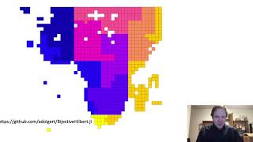

# BijectiveHilbert

[](https://adolgert.github.io/BijectiveHilbert.jl/stable)
[](https://adolgert.github.io/BijectiveHilbert.jl/dev)
[](https://github.com/adolgert/BijectiveHilbert.jl/actions)
[](https://codecov.io/github/adolgert/BijectiveHilbert.jl)

Five [Hilbert curve](https://en.wikipedia.org/wiki/Hilbert_curve) algorithms,
implemented from original papers, with bug fixes. Type stable, tested
exhastively, including a new continuous curve for domains with unequal side lengths.

```julia
julia> using Pkg; Pkg.add("BijectiveHilbert")
julia> using BijectiveHilbert
julia> xy_coordinates = zeros(Int, 8, 8)
julia> for y in 1:size(xy_coordinates, 2)
           for x in 1:size(xy_coordinates, 1)
               z = encode_hilbert(Simple2D(Int), [x, y])
               xy_coordinates[x, y] = z
           end
       end
julia> xy_coordinates
8×8 Array{Int64,2}:
  1   2  15  16  17  20  21  22
  4   3  14  13  18  19  24  23
  5   8   9  12  31  30  25  26
  6   7  10  11  32  29  28  27
 59  58  55  54  33  36  37  38
 60  57  56  53  34  35  40  39
 61  62  51  52  47  46  41  42
 64  63  50  49  48  45  44  43
julia> X = zeros(Int, 2)
julia> decode_hilbert!(Simple2D(Int), X, xy_coordinates[5, 7])
julia> X == [5, 7]
```
This function, called a [Hilbert curve](https://en.wikipedia.org/wiki/Hilbert_curve), is used most often for geospatial work or database implementation but is equally appropriate for dealing with large TIFF files. It belongs to the class of space-filling, self-avoiding, simple, and self-similar (FASS) curves, which includes Peano curves, and Morton z-curves.

Included are several variations of the Hilbert curve. They are type-stable and thoroughly tested, including bug fixes to amend the published algorithms.

## Release Notes

| Version | Date | Changes |
|---------|------|---------|
| 0.5.0 | 2025-04-14 | Simple2D is 2x faster, added support for StaticArrays |
| 0.4.0 | 2023-12-29 | Removed Compact from interface, comprehensive test suite |
| 0.3.0 | 2021-03-01 | Made Simple2D type-stable, combinatorial testing |
| 0.2.0 | 2021-02-03 | Fixed bitshifting bug, improved GlobalGray type handling |
| 0.1.0 | 2020-12-17 | Initial release |

## Hilbert curves for computation

A video about using Hilbert curves:

[](https://youtu.be/MlfS7xo2L7w)
