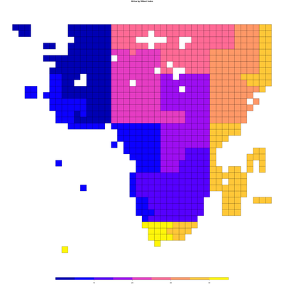

# BijectiveHilbert

[](https://adolgert.github.io/BijectiveHilbert.jl/stable)
[](https://adolgert.github.io/BijectiveHilbert.jl/dev)
[](https://github.com/adolgert/BijectiveHilbert.jl/actions)
[](https://codecov.io/gh/adolgert/BijectiveHilbert.jl)

Data in two or more dimensions is stored linearly, so places nearby in the data can be far in memory or on disk. This package offers functions that make multi-dimensional data storage and retrieval more efficient by sorting them so that nearby data is nearby in memory.

```julia
julia> using Pkg; Pkg.add("BijectiveHilbert")
julia> using BijectiveHilbert
julia> xy = zeros(Int, 8, 8)
julia> for y in 1:size(xy, 2)
           for x in 1:size(xy, 1)
               z = encode_hilbert(Simple2D(Int), [x, y])
               xy[x, y] = z
           end
       end
julia> X = zeros(Int, 2)
julia> decode_hilbert!(Simple2D(Int), X, xy[5, 7])
julia> X == [5, 7]
julia> xy
8×8 Array{Int64,2}:
  1   2  15  16  17  20  21  22
  4   3  14  13  18  19  24  23
  5   8   9  12  31  30  25  26
  6   7  10  11  32  29  28  27
 59  58  55  54  33  36  37  38
 60  57  56  53  34  35  40  39
 61  62  51  52  47  46  41  42
 64  63  50  49  48  45  44  43
```
This function, called a [Hilbert curve](https://en.wikipedia.org/wiki/Hilbert_curve), is used most often for geospatial work or database implementation but is equally appropriate for dealing with large TIFF files. It belongs to the class of space-filling, self-avoiding, simple, and self-similar (FASS) curves, which includes Peano curves, and Morton z-curves.

Included are several variations of the Hilbert curve. They are type-stable and thoroughly tested, including bug fixes on three of the implementations.

* [`Simple2D`](https://computingkitchen.com/BijectiveHilbert.jl/stable/simple2d/), shown above, two-dimensional. Doesn't need to know axis dimensions, from Chen, Wang, and Shi.
* [`GlobalGray`](https://computingkitchen.com/BijectiveHilbert.jl/stable/globalgray/), an n-dimensional curve where all axis dimensions must be equal, from Skilling.
* [`SpaceGray`](https://computingkitchen.com/BijectiveHilbert.jl/stable/compact/), an n-dimensional curve with a different path. All axis dimensions must be equal, from Hamilton and Rau-Chaplin.
* [`Compact`](https://computingkitchen.com/BijectiveHilbert.jl/stable/compact/), an n-dimensional curve the permits each axis to be a different size, from Hamilton and Rau-Chaplin.
* [`FaceContinuous`](https://computingkitchen.com/BijectiveHilbert.jl/stable/facecontinuous/), an n-dimensional curve, the oldest version from Butz and Lawder.

# Hilbert curves for computation

A video about using Hilbert curves:

[](https://youtu.be/MlfS7xo2L7w)
